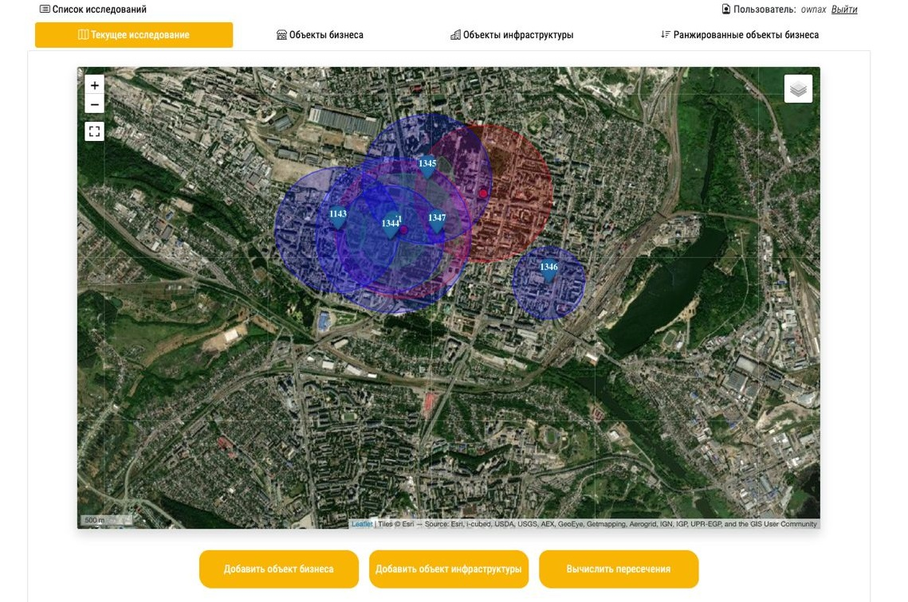
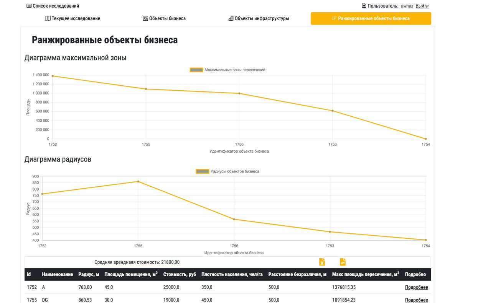

Научный проект системы геомаркетингового анализа 
-----------

***
Предназначен для определения перспективных местоположений для открытия бизнеса.
Реализован на основе метода, разработанного специалистами в области геомаркетинговых исследований
Суть метода и работы программы - поиск наиболее перспективных для открытия точек бизнеса в 
зависимости от географических и маркетинговых факторов. 
***
Скриншоты программы:
-----------------------------------

#### Страница работы с исследованием

#### Страница результатов

Используемые технологии:
-----------------------------------
<li> Django (GeoDjango) - веб-фреймворк с расширением обработки географических данных</li>
<li> Postgres (Postgis) - система управления базами данных </li>
<li> Leaflet - реализация работы с цифровой картой </li>
<li> Bootstrap 4, Chart.js - пользовательский интерфейс, диаграммы </li>

